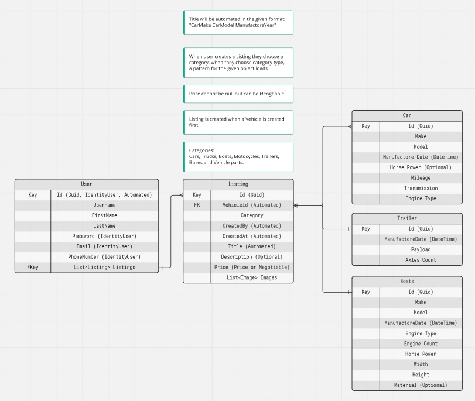

# TopAutoSpot🚦

## Table of contentsℹ️
<strong>[About](#about)
 
[Building the project](#building-the-project)
 
[Contributing](#contributing)
 
[Built with](#built-with)
 
[License](#license)</strong>
 

## About📝
<strong>
TopAutoSpot is a website where people can trade, sell, buy or auction their vehicles.
 
Each user will be notified via email when something happens with their listings or listings they are interested in.
 
Vehicles can be from type: Cars, Trucks, Caravans, Boats, Motocycles, Trailers, Buses and Vehicle parts.
</strong>

## Building the project⚙️
<strong>In order to build the project you will have to... TODO</strong>
 

## Contributing🧑‍🔧
<strong>Before contributing to the project you should email the TSC for collaborator access.
 
If you get approved then you can start contributing to the project.
 
Note that the project is very strict so we need people that ensure they will write clean code.
 
All kinds of leaks about the project are sued.
</strong>

## Current team members🧑
<a href="https://github.com/viktorgkw">Viktor Georgakiev</a>

## Built with💻
<strong>ASP.NET Core (.NET 7)</strong>
 
<strong>Bootstrap</strong>

## Database Schema📊
<strong>This is a rough scheme of the application's database:</strong>
 
 

## License📃
<strong>TopAutoSpot is available under the <a href="https://choosealicense.com/licenses/bsd-3-clause/">BSD 3</a> license.</strong>
